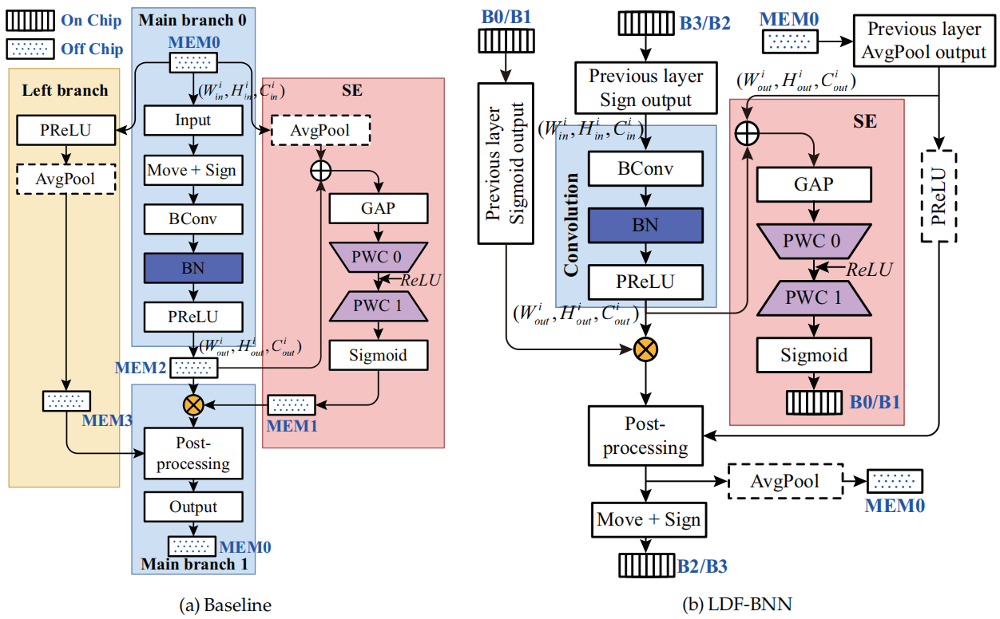

# LDF-BNN : A real-time and high-accuracy BNN accelerator based on the improved BNext



## Installation environment
```
python==3.10.9
pytorch==1.13.1 
torchvision==0.14.1 
torchaudio==0.13.1 
pytorch-cuda=11.6 
timm==0.6.12
cudatoolkit==1.16.1
nvidia-dali-cuda110==1.31.0
```

## Run
```
cd ./LDF-BNN/src
sh ./script/LDFBNN-Cifar10/run_distributed_on_disk_a6k5_AdamW_Curicullum_Tiny_assistant_teacher_num_1_aa.sh
```

## Thanks
Part of the code references [BNext](https://github.com/hpi-xnor/BNext). Please ref to their reposity for more details.